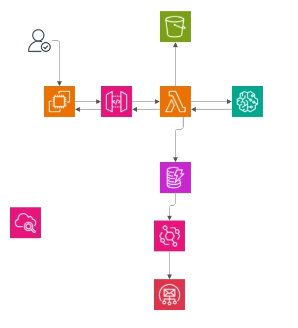

## Project Recap

### Idea Hub Concept
Convert spoken ideas into structured outlines using advanced AI models and AWS services.

### Technologies Used
- **Whisper**: For speech-to-text conversion.
- **GPT-4**: For generating outlines from transcribed text.
- **Gradio**: For the frontend and user interface.
- **AWS Services**: 
  - Lambda
  - SageMaker
  - S3
  - DynamoDB
  - SNS
  - API Gateway
  - EventBridge
  - CloudWatch

### Workflow

1. **User Interaction**: User records their idea using the Gradio interface on an EC2 instance.
2. **Audio Processing**: Audio file is uploaded to S3 and converted to text using Whisper.
3. **Outline Generation**: Text is sent to GPT-4 via a Lambda function, and the generated outline is stored in DynamoDB.
4. **Notification**: EventBridge triggers an SNS notification to the user once the outline is stored.
5. **Monitoring**: CloudWatch monitors the entire process.

### Code and Configuration
- **Lambda Function**: Handles backend logic, including calling the SageMaker endpoint, uploading files to S3, storing data in DynamoDB, and sending notifications via SNS.
- **CloudFormation Templates**: Define the infrastructure setup for EC2, S3, SNS, EventBridge, and other AWS services.
